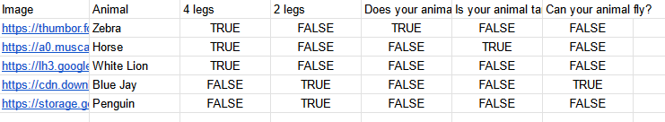
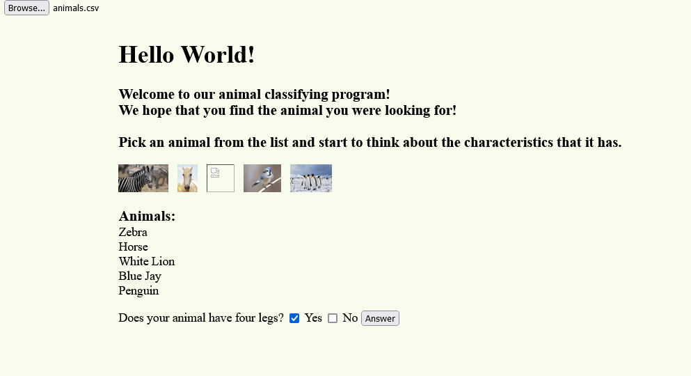

# animalpicker
Website for kids to pick animals for a friend. A friend asked me to help her with some code, she was using "if-else" statements to complete this animal selecting alogirthm, and I mentioned that she could probably use a dictionary and web interface to get the affect that she was looking for. Using a spreadsheet allows for the questions to be customizable for the dictionary search and creation. A possible upgrade would be not forcing the user to upload the spreadsheet themselves.

# Webpage

The design is very simple html, most of the effort is in the algorithm. An update to this could be utilizing a nicer front-end design technique.

